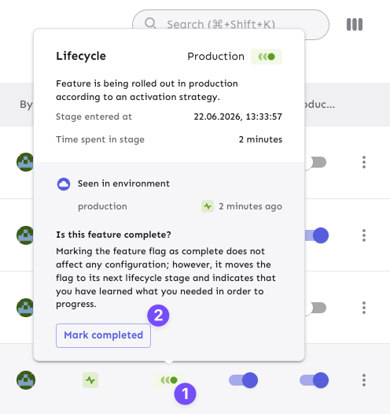
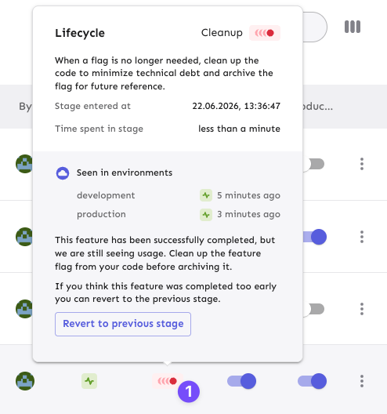

# Step 8: Lifecycle and Governance

It's time to close the loop: flags are inventory. You will retire another flag cleanly so they don't become debt at AI speed. [FeatureOps](https://featureops.io) recommends treating feature flags as inventory, where the flag _type_ carries lifecycle intent. For example, a `release` flag that has fully rolled out is ready for cleanup, while a `kill-switch` flag is meant to live indefinitely. Additionally, you will see the governance layer that provides a paved path in action, including Role-Based Access Control (_RBAC_), change requests, and auditability.

## Steps

- [ ] **Turn on change requests for _production_.**
  - Open your project's _Settings_ → _Change request configuration_ (`make workshop-final-check` prints the direct link, or go to `https://<REGION>.app.unleash-hosted.com/<INSTANCE_ID>/projects/<your-project-id>/settings/change-requests`), and enable them for the `production` environment with **1 approval**.
    - Everything you've done up to now applied the instant you clicked it. From here on, production is gated — that is the point of this step. Your role already carries the necessary permissions, but the guard itself was left off, so steps 5–7 wouldn't queue a draft on every change.
- [ ] We have pre-picked the cleanup-worthy release: the promo-code flag, `<prefix>rl_checkout-page_payment-section_promo-code` (`make workshop-final-check` printed your prefix, if you have one).
  - First, let's make sure it's rolled out in _development_ **AND** _production_, by enabling the flag in both environments.
    - For the latter environment — now that you've just gated it — the change lands in a _change request_ draft instead of applying. Notice the **segregation of duties** (it's a feature, not a snag): you can **open** a production change request, but you **cannot approve your own**. Ask the facilitator/admin to approve and apply it (**workshop lecturer**, add that person as a **reviewer**, they are already part of your group).
      - Working through this self-paced on your own instance? You're an Unleash admin there, so you can approve and apply it yourself — the segregation of duties is the lesson, not a wall.
- [ ] Verify the presence of the promotion code text box in both environments and then mark the feature flag as completed, choosing to keep the feature.
  - You should hover over the _green lifecycle phase_ icon (_1_), and then click the button (_2_).
    - 
  - After choosing "_keep the feature_"", you will see that the corresponding _lifecycle icon_ changed to _red_ color. You can hover over that icon (_1_) to learn more.
    - 
- [ ] Now, it's time to ask your AI coding assistant to use `cleanup_flag` on flags that are ready for cleanup.
  - The AI agent will generate safe-removal instructions for your fully rolled-out flag: remove the unused guarded branch, confirm the code path is clean, and then suggest to archive the flag in _Unleash_.
- [ ] Apply or just _review_ the cleanup _diff_ and verify the feature code is unguarded (or removed), and the flag is archived in your project.

## Outcome / success

Flag guarding the _promotion code_ functionality has completed its lifecycle. After the cleanup, the code path is clean, with the archive recorded in the audit log (which you can verify under this _URL_: `https://<REGION>.app.unleash-hosted.com/<INSTANCE_ID>/projects/<your-project-id>/logs`, or `make workshop-final-check` prints the exact link you need).

You have full control over who can change what, in which environment, gated by approvals, with proper auditability. This is enterprise-grade governance.

<details>
<summary><strong>Example prompt</strong>: Clean up the flag</summary>

```
Inspect flags that are ready to cleanup: fully rolled out and no longer needed. Use the Unleash MCP server cleanup_flag tool to generate the safe removal steps, then remove the unused branch from the code, and confirm the code path is clean. Provide a recommendation is it safe to archive that flag or not, asssuming the provided changes will be applied and deployed.
```

</details>

## Tips and Tricks

> Notice the governance reveals: you've been acting as a **scoped, non-admin user**, and changing **production** now requires a **change request**. The custom role and your access were provisioned via Terraform before you arrived — but the guard itself you switched on yourself, in one click, on a live project. That is the whole point: this governance is a setting, not a rebuild.

> If you're short on time, the lifecycle management and `cleanup_flag` reveal is the takeaway. The RBAC, change requests, and audit logs are part of the short narration you can read above without clicking.
